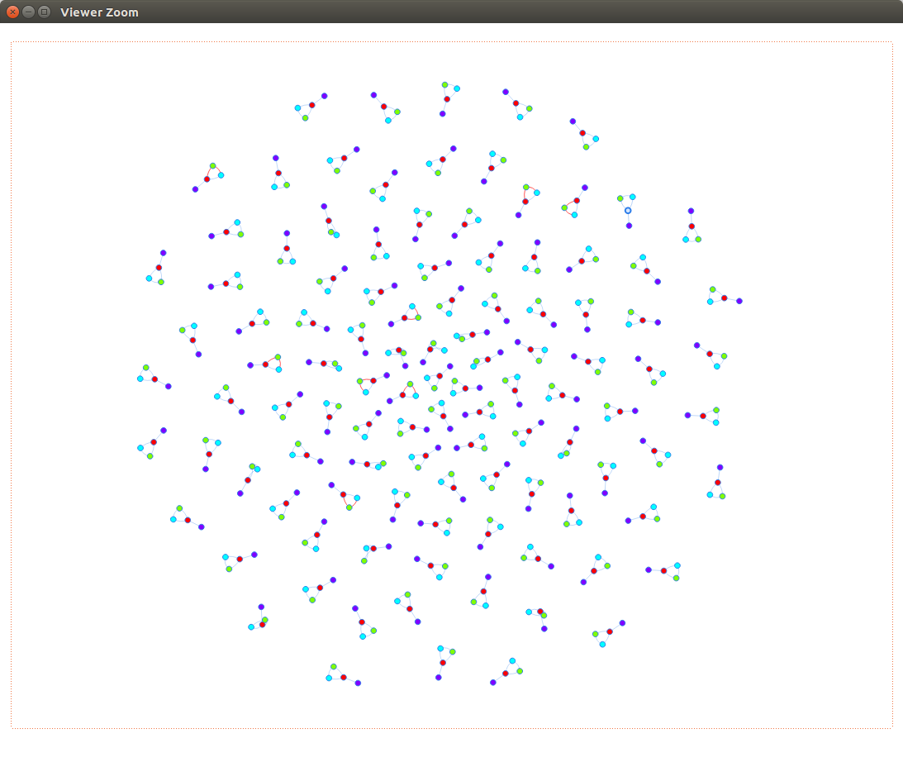
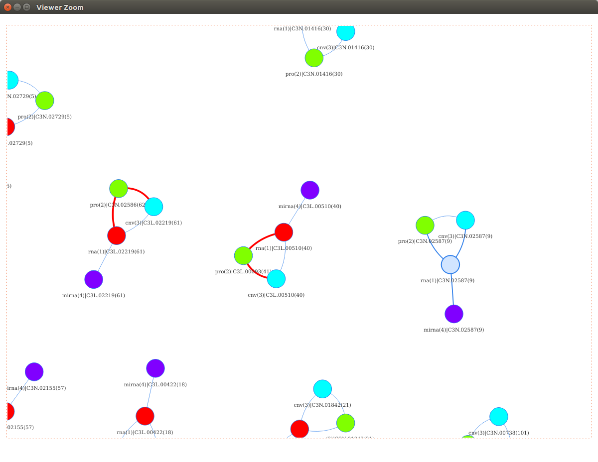

# MultiOmics_NetworkAlignment
MONA (MultiOmics_NetworkAlignment) is an R package in detecting and identifying multi-omics sample mislabeling.


## Table of contents
* [Loading Data](#loaddata)
  * [Dataset source and error](#source_error)
* [Pairwise Alignments](#pa)
  * [Determine pairwise alignments](#determine_pa)
  * [Run Pairwise Alignments](#run_pa)
* [Network Alignment](#run_na)
* [Network Visualization](#visualize_na)
* [Citing MONA](#mona_cite)


# <a name="loaddata"></a>Loading Data
```
omicsdatas <- list()
omicsdatas[[1]] <- read.delim('ExampleData/LUAD_1rna.tsv')
omicsdatas[[2]] <- read.delim('ExampleData/LUAD_2pro.tsv')
omicsdatas[[3]] <- read.delim('ExampleData/LUAD_3cnv.tsv')
omicsdatas[[4]] <- read.delim('ExampleData/LUAD_4mirna.tsv')
omicstypes <- c('rna', 'pro', 'cnv', 'mirna')
```

`omicsdatas` = the list of matrices, with each dataset matrix represents each omicsdata. <br>
`omicstypes` = vector of string, with each string indicates the types of each omicsdata. Options are 'rna', 'pro', 'cnv' & 'mirna' <br>
Note: the omicsdata types could be duplicated, i.e., mRNA before drug could be used to compare with mRNA after drug.

## <a name='source_error'></a>Dataset source and error

The example datasets are published by CPTAC, collected from patients diagnosed with Lung Adenocarcinoma (LUAD). Eight proteomic samples are found to be mislabeled and are corrected upon publishing in the official website. These datasets are uncorrected, meaning that the final output should find 8 proteomic mislabeled samples (4 pairs of swapping).


# <a name='pa'></a>Pairwise Alignments
## <a name="determine_pa"></a>Determine pairwise alignments
This code outputs a table which determine how many pairwise alignments will be performed.
```
> alignments <- determine_alignment(omicstypes)
> alignments
  omic.x omic.y omic.x.type omic.y.type align.type
1      1      2         rna         pro          1
2      1      3         rna         cnv          1
3      1      4         rna       mirna          2
4      2      3         pro         cnv          1
```
Note: miRNA has been found to be correlated with its host-gene transcript. Thus, miRNA will only paired with RNA. <br>


## <a name="run_pa"></a>Run pairwise alignment
The codes run each pairwise alignment in the table `alignments` and store the results of each alignment in `align_outputs`
```
align_outputs <- list()
for (i in 1:nrow(alignments)) {
  omic.x <- alignments$omic.x[i]
  omic.y <- alignments$omic.y[i]
  omic.x.type <- alignments$omic.x.type[i]
  omic.y.type <- alignments$omic.y.type[i]
  align.type <- alignments$align.type[i]
  align_outputs[[i]] <- align_omics(omicsdatas[[omic.x]], omicsdatas[[omic.y]], omic.x.type, omic.y.type, align.type)
}
```


# <a name="run_na"></a>Network Alignment
The sample correlations in each pairwise alignments are utilized to do network alignment.

```
> comm_id <- network_alignment(omicstypes, alignments, matchings, samplecors)
> colnames(comm_id) <- paste0(omicstypes, '_', 1:length(omicstypes))
> comm_id <- as.data.frame(comm_id)
> head(comm_id)
  rna_1 pro_2 cnv_3 mirna_4
1     1     1     1       1
2     2     2     2       2
3     3     3     3       3
4     4     4     4       4
5     5     5     5       5
6     6     6     6       6
```

`comm_id` is the table of corrected labels. Each integer in this label represents each patient. A particular row of table with a consistent label across all columns, means there is no mislabeling for that patient.


# <a name="visualize_na"></a>Network Visualization
The network alignment are visualized using package `visNetwork`.
```
> visualize_network(nodes, edges)
```




The network is interactive. User is free to modify and inspect the network.
Each node represent each instance in omics data, where different datasets are represented by different colors.

The edges connect omics samples that are correlated to each other. Red-colored edges indicates that the connected samples are from different patient(label).
Samples with no mislabeling should connected to each other, and form a cluster with consistent label with no red-colored edges.

The above examples show that proteomic data of patient 41 are connected to the cluster of patient 40, highly suggesting that it is mislabeled (original label = 41, corrected label should be 40).


# <a name="mona_cite"></a>Citing MONA
Kho, S. J. (2021). Sample Mislabeling Detection and Correction in Bioinformatics Experimental Data (Doctoral dissertation, Wright State University).

Dataset source:
Gillette, M. A., Satpathy, S., Cao, S., Dhanasekaran, S. M., Vasaikar, S. V., Krug, K., ... & Thangudu, R. R. (2020). Proteogenomic characterization reveals therapeutic vulnerabilities in lung adenocarcinoma. Cell, 182(1), 200-225.

